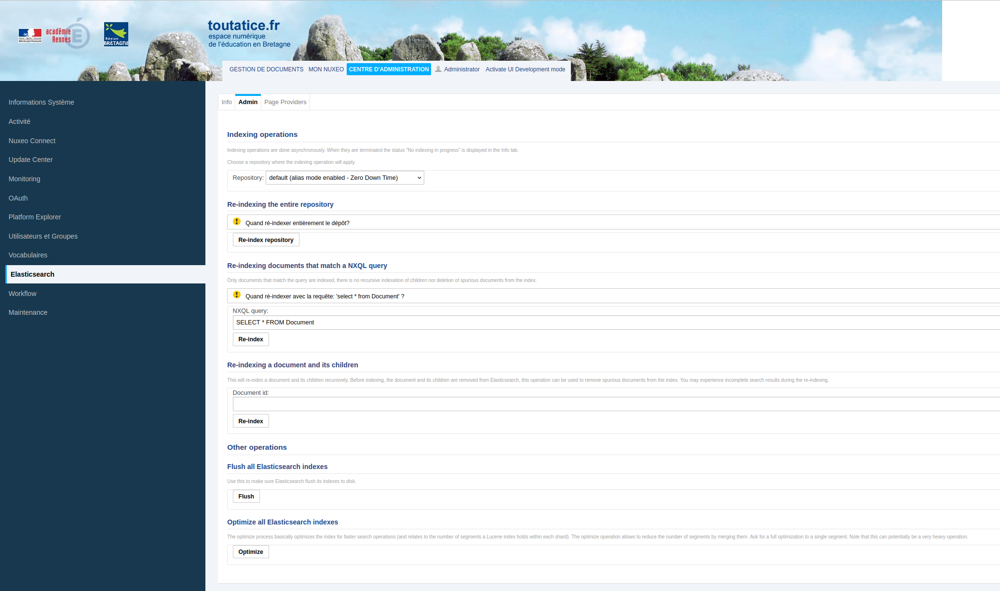

# opentoutatice-addon-elasticsearch

#### Mise en place du Zero Down Time
##### Prérequis
Vérifier l'espace disque pour le réindexation. La taille des index existants peut-être déterminée par la requête suivante sur le cluster Elasticsearch:
```
curl localhost:9200/_cat/indices?v
```

##### Configuration Nuxeo
###### Alias
Editer le `nuxeo.conf` et suffixer les index de repository voulus par `-alias`. Par exemple, remplacer:
```
elasticsearch.indexName=nuxeo
```
par
```
elasticsearch.indexName=nuxeo-alias
```

###### Threads
Editer le `nuxeo.conf` et indiquer le nombre de threads que la queue de réindeaxtion en masse des documents doit utiliser (queue non bornée). Par défaut il vaut 4 mais peut être redéfini avec la propriété:
```
elasticsearch.zero.down.time.reindexing.maxThreads=x
```

###### Boucle d'attente
Par défaut, Nuxeo vérifie toutes les 30 secondes si le ZDT est terminé. Cette valeur peut être modifée par la propriété
`ottc.reindexing.check.loop.period`, valorisée en secondes, du fichier `nuxeo.conf`


###### Logs
Les logs de réindexation du ZDT sont configurés comme suit dans le `/opt/nuxeo/lib/log4j2.xml`:
```
<!-- ==== Elasticsearch logging ===== -->
<!-- == Set trace level on the first two to see search requests, index requests, ... == -->
    <Logger name="org.nuxeo.elasticsearch" level="info" additivity="false">
      <AppenderRef ref="ELASTIC" />
    </Logger>
    <Logger name="org.opentoutatice.elasticsearch" level="info" additivity="false">
      <AppenderRef ref="ELASTIC" />
    </Logger>
     <Logger name="org.nuxeo.ecm.core.work.AbstractWork" level="info" additivity="true">
      <AppenderRef ref="ELASTIC" />
    </Logger>
```
et sont donc tracés dans le fichier `elastic.log`.

##### Postrequis
Redémarrer Nuxeo

##### Utilisation

Accéder à l'interface d'administration d'Elasticsearch dans Nuxeo sous `Centre d'Administration > Elasticsearch`, onglet `Admin`:



- Choisir le repository à indexer dans la liste déroulante (si le repository est configuré pour le ZDT, cela est indiqué)
- Cliquer sur le bouton `Re-index repository`
